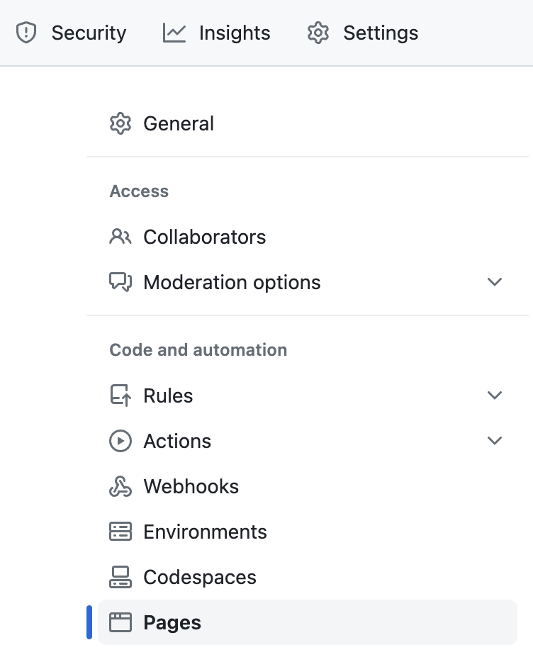
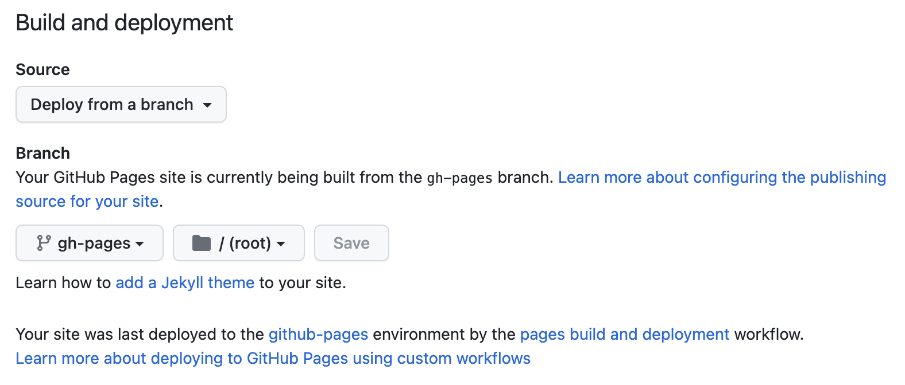

# Jupyter Book

## GitHub 저장소 생성
Jupyter Book 문서를 관리하고, 배포하기 위한 새로운 GitHub 저장소를 `public`으로 생성합니다.

## `Actions` 권한 설정
### 상단의 Settings -> Actions -> General 설정에 진입합니다.


### Workflow permissions를 설정합니다.
Read and write permissions를 선택합니다.  
Allow GitHub Actions to create and approve pull requests 기능을 활성화합니다.  
반드시 `Save` 버튼을 눌러 저장합니다.  


## GitHub 저장소 복사 및 수정
### GitHub 저장소 복사
#### 처음에 만든 개인 저장소를 로컬에 clone 받습니다.
#### [jupyter-book-example](https://github.com/QbQi/jupyter-book-example) 저장소의 내용을 복사하여 만들어둔 저장소에 붙여넣습니다.
```{note}
위 저장소에 접속하신 후 `star`를 눌러주시면 작성자의 기분이 좋습니다.
```

### GitHub 저장소 수정
```{note}
아무런 데이터를 수정하지 않으셔도 문제 없고, 수정을 원하는 모든 내용을 수정해도 됩니다!  
다만, 빠른 최초 배포를 위해 아래의 내용들만 수정 후 배포하시는걸 추천합니다.
```
#### `pyproject.toml` 수정
아래 부분을 원하는 내용으로 수정합니다.
```toml
name = "jupyter-book-example"
version = "0.1.0"
description = "jupyter book example"
authors = ["QbQi <aloha@qbqi.dev>"]
```

#### `LICENSE` 수정
원하는 라이센스로 변경합니다.  
MIT 라이센스를 그대로 사용하고 싶으시다면, 아래의 연도와 이름만 수정합니다.
```
Copyright (c) 2023 QbQi
```

#### `docs/_config.yml` 수정
아래 부분을 원하는 내용으로 수정합니다.
```yml
title: "Jupyter Book Example"
logo: images/logo/logo.png
author: "QbQi (aloha@qbqi.dev)"
copyright: "2023"
email: aloha@qbqi.dev
description: >-
  Jupyter Book Example

url: https://github.com/QbQi/jupyter-book-example
```

#### commit 후 push
내용 수정이 모두 마무리 되었다면, 로컬에서 commit 후 push 합니다.

## `Pages` 설정
### Actions 확인
상단의 Actions에 진입하여, `deploy-jupyter-book` 액션(마지막 커밋 이름)이 정상적으로 실행 되었는지 확인합니다.

### Branch 확인
레포지토리의 메인 페이지로 돌아와서 아래의 이미지처럼 `gh-pages` 브랜치가 생성되었는지 확인합니다.


### 상단의 Settings -> Pages 설정에 진입합니다.


### Deploy branch 설정을 변경합니다.
Build and deployment 설정에서 아래의 이미지와 같이 Branch를 gh-pages, 디렉토리를 /(root)로 설정합니다.


## 배포 확인
### Actions 확인
상단의 Actions에 진입하여, `pages build and deployment` 액션이 정상적으로 실행 되었는지 확인합니다.

### 웹페이지 확인
위의 액션 상세 페이지에 접속하여 `deploy`항목에 있는 url을 누르면 만들어진 웹페이지로 이동합니다.

:::{admonition} `Jupyter Book` 더 알아보기
:class: seealso
[Jupyter Book](https://jupyterbook.org/)
:::
