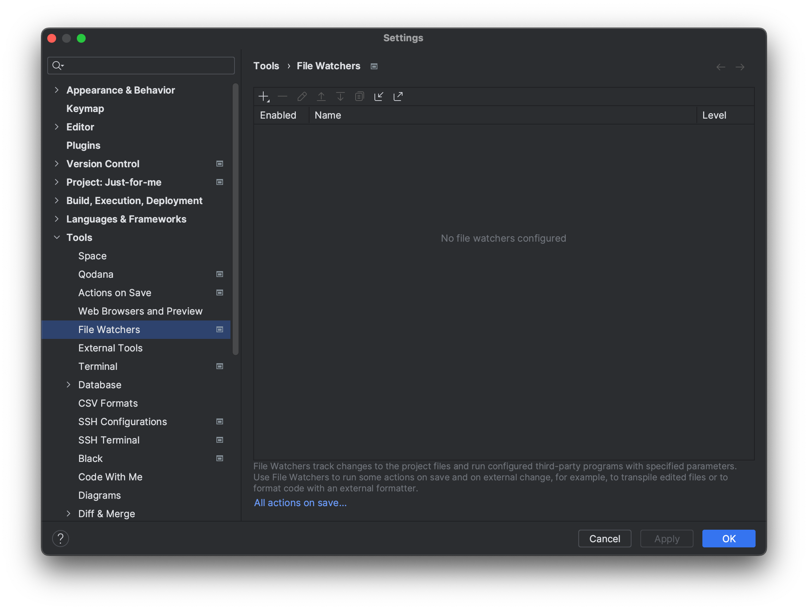
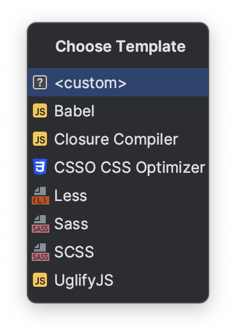
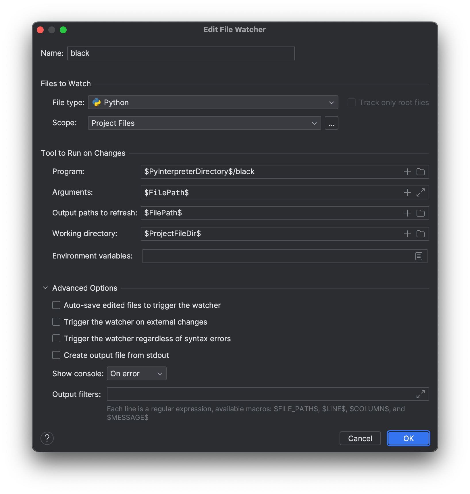

# Lint with PyCharm File Watchers

## File Watchers 설정
### `Settings` -> `Tools` -> `File Watchers` 설정 진입

### `+`버튼 누른 후 `<custom>` 선택

### `Black` File Watchers 설정

### `isort` File Watchers 설정

